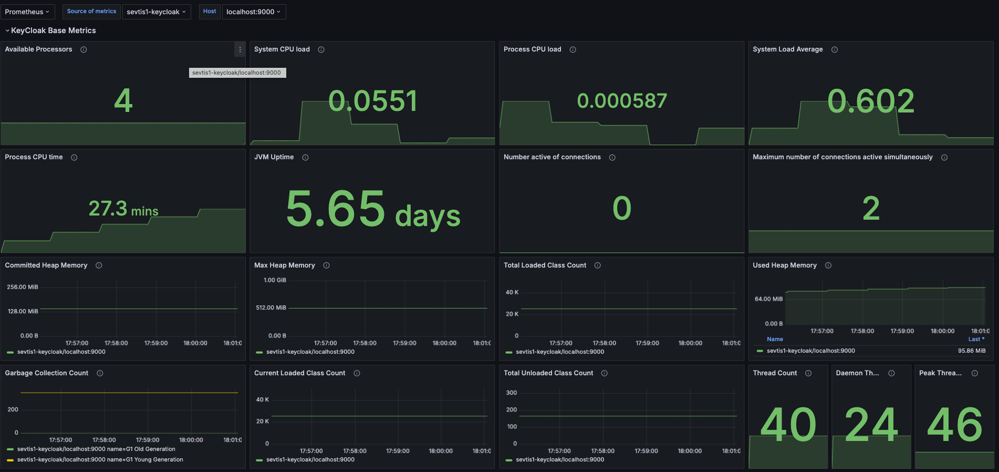
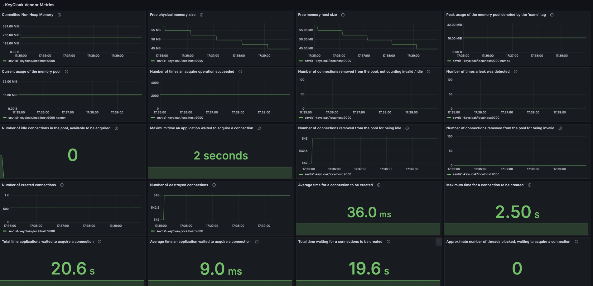

# Keycloak Grafana Dashboard

## Description

Includes a [KeyCloak](https://www.keycloak.org/) Grafana dashboard to display the Quarkus MicroProfile metrics.

## Functionality

Visualize the corresponding KeyCloak Quarkus MicroProfile metrics from the selected Grafana data source.

## Grafana Dashboard

[KeyCloak Grafana Dashboard](https://grafana.com/grafana/dashboards/14390)

## Changelog
- Version 1: Initialization of the first version of the Quarkus-based Keycloak dashboard
- Version 2: The dashboard version includes a switch of the Grafana graph to the time-series type
- Version 3: Adjust the dashboard to support the Keycloak version 25 metrics
- Version 4: Adjust the dashboard to shrink down the Grafana dashboard file
- Version 5: Adjust the dashboard data source variable name
- Version 6: Adjust the dashboard name

## Images

### Base metrics

### Vendor metrics

## Contribution

If you would like to contribute, have an improvement request, or want to make a change inside the code, please open a pull request.

## Support

If you need support, or you encounter a bug, please don't hesitate to open an issue.

## Donations

If you want to support my work, I ask you to take an unusual action inside the open source community. Donate the money to a non-profit organization like Doctors Without Borders or the Children's Cancer Aid. I will continue to build tools because I like them, and I am passionate about developing and sharing applications.

## License

This product is available under the Apache 2.0 [license](LICENSE).
