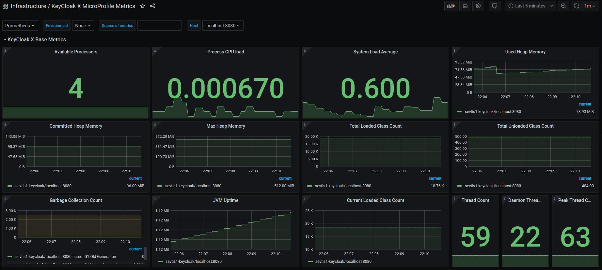
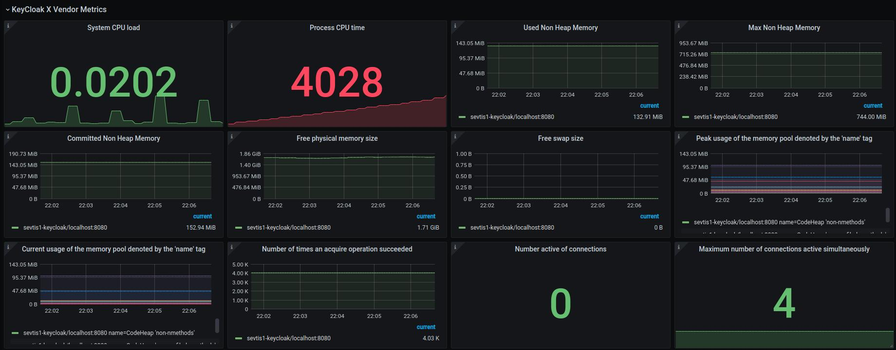
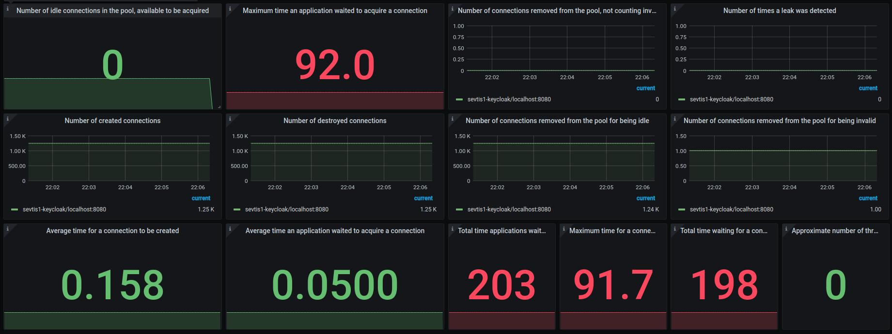

# keycloak.X-grafana-dashboard

## Description
Includes a [KeyCloak.X-Preview](https://www.keycloak.org/2020/12/first-keycloak-x-release.adoc) Grafana dashboard to display the Quarkus MicroProfile metrics

## Functionality

Visualize the corresponding KeyCloak.X-Preview Quarkus MicroProfile metrics from the selected Grafana data source.

## Grafana Dashboard
[KeyCloak X Grafana Dashboard](https://grafana.com/grafana/dashboards/14390)

## Images

### Base metrics

### Vendor metrics

## Contribution

If you would like to contribute, have an improvement request, or want to make a change inside the code, please open a pull request.

## Support

If you need support or you encounter a bug, please don't hesitate to open an issue.

## Donations

If you would like to support my work, I ask you to take an unusual action inside the open source community. Donate the money to a non-profit organization like Doctors Without Borders or the Children's Cancer Aid. I will continue to build tools because I like it and it is my passion to develop and share applications.

## License

This product is available under the Apache 2.0 [license](LICENSE).
